<p align="center">
  
</p>

<h1 align="center">Flora</h1>

<p align="center">
  <strong>A lightweight multimodal brain encoding model that predicts fMRI responses to naturalistic video stimuli.</strong><br/>
  <strong>Лёгкая мультимодальная модель кодирования мозга, предсказывающая фМРТ-ответы на естественные видеостимулы.</strong>
</p>

Flora maps the audio, visual and textual content of a naturalistic video directly onto cortical activity predictions. It combines compact frozen encoders (~67M frozen parameters) with a highly efficient trainable fusion stack of **~14M trainable parameters**, and produces predictions on the **Schaefer-400 parcellation**, projected onto the full **fsaverage5 cortical surface (20,484 vertices)** for visualization.

Repository: https://github.com/qaddasd/Flora.git

## Paper / Статья

The paper is published in two versions. Both are currently available in Russian only; versions in other languages are coming soon. / Статья публикуется в двух версиях. Обе пока доступны только на русском языке; версии на других языках — в скором времени.

| Version / Версия | File / Файл |
|:---|:---|
| **Official version / Официальная версия** — full version, 35 pages / полная версия, 35 стр. | [web-demo/main.pdf](./web-demo/main.pdf) |
| **RKNP version / Версия для РКНП** — NIS Aktau science project, 20 pages / научный проект НИШ г. Актау, 20 стр. | [web-demo/mainv2.pdf](./web-demo/mainv2.pdf) |

> On the [web demo](https://qaddasd.github.io/Flora/web-demo/) the *Read the Paper / Читать статью* button opens a picker with both versions: official [`web-demo/main.pdf`](./web-demo/main.pdf), RKNP [`web-demo/mainv2.pdf`](./web-demo/mainv2.pdf). / В [веб-демо](https://qaddasd.github.io/Flora/web-demo/) кнопка *Читать статью / Read the Paper* открывает выбор из двух версий: официальная — [`web-demo/main.pdf`](./web-demo/main.pdf), для РКНП — [`web-demo/mainv2.pdf`](./web-demo/mainv2.pdf).

---

# English

## Overview

Flora is a whole-brain encoding model: given the soundtrack, the visual stream and the transcript of a video, it predicts the blood-oxygen-level-dependent (BOLD) response of the human cortex over time. The design follows three principles:

1. **Frozen perception, trainable fusion.** All three stimulus encoders are kept frozen; only the multimodal fusion stack and the cortical output head are trained. This keeps the trainable budget at ~14M parameters and training stable on a single GPU.
2. **Neurophysical priors.** The known ~6 s hemodynamic delay is injected as an inductive bias through a learnable hemodynamic response function (HRF) convolution layer and an HRF-decay attention bias, instead of being learned from data.
3. **Sparse, specialized computation.** A Mixture-of-Experts (MoE) transformer lets experts specialize over modalities and cortical systems at constant compute cost, while gated modality pooling lets each cortical region weigh text, audio and video according to its functional role.

## Key Features

- **Multimodal encoding** — jointly consumes video (2 fps), audio (16 kHz) and transcript.
- **~14M trainable parameters** — two orders of magnitude below conventional large-scale encoding models.
- **HRF-aware temporal modeling** — learnable double-Gamma HRF convolution plus HRF-decay attention bias.
- **Mixture-of-Experts fusion** — 8 experts, top-2 routing, load-balancing and z-loss regularization.
- **Subject generalization** — per-subject FiLM conditioning replaces per-subject weight matrices; a new subject requires only two small conditioning vectors.
- **End-to-end pipeline** — feature extraction, inference and cortical surface rendering from a single video file.

## Architecture

The pipeline (see the figure at the top) processes three parallel streams sampled from the input video.

### 1. Frozen modality encoders

| Modality | Encoder | Output dim | Parameters |
|:---|:---|:---:|:---:|
| Text (transcript) | `all-MiniLM-L6-v2` | 384 | 22.7M (frozen) |
| Audio (16 kHz) | `Whisper-Tiny` encoder | 384 | 39M (frozen) |
| Video (2 fps) | `MobileViT-S` | 640 | 5.6M (frozen) |

### 2. Modality projectors

Each encoder output passes through a dedicated 3-layer MLP projector ($d_m \rightarrow 768 \rightarrow 512$) with LayerNorm and GELU. The video projector is followed by a depthwise temporal convolution (kernel 3) that supplies the frame-to-frame motion signal missing from per-frame encoders — critical for motion-sensitive cortex (MT+/V5).

### 3. Tokenization of time

Per-modality learned temporal embeddings are added, then the three streams are interleaved into a single token sequence $[v_1, a_1, \ell_1, v_2, a_2, \ell_2, \dots]$ so that same-timestep cross-modal attention is available from the first layer. A shared positional embedding is added on top.

### 4. Mixture-of-Experts fusion transformer

Four pre-norm transformer layers (8 heads x 64-d):

- **Layers 1-2** — local temporal attention with a learned HRF-decay bias, reflecting that recent stimulus history dominates the current BOLD response.
- **Layers 3-4** — full attention for narrative-level semantic integration.
- Every feed-forward block is a **Mixture of Experts**: 8 experts, top-2 routing, load-balancing auxiliary loss and router z-loss for stable, uniform expert utilization.
- Stochastic depth with a linear schedule regularizes deeper layers.

### 5. Gated modality pooling

Instead of mean-pooling the three modality tokens at each timestep, Flora learns sigmoid gates over text/audio/video, so different cortical regions can weight modalities according to their function (visual cortex -> video, language cortex -> text).

### 6. HRF convolution layer

A depthwise temporal convolution (kernel 8, ~12 s at TR = 1.5 s) initialized with the canonical double-Gamma HRF kernel and fine-tuned during training.

### 7. Subject-conditioned output head

A shared MLP maps fused representations toward cortex, with per-subject FiLM conditioning ($\gamma_s \odot x + \beta_s$) absorbing anatomical variability. The head emits 400 parcel time series (Schaefer-400), unpacked to the 20,484-vertex fsaverage5 surface for evaluation and rendering.

### Parameter budget

| Component | Trainable parameters |
|:---|:---:|
| Modality encoders (frozen) | 0 (67.3M frozen) |
| Projectors + temporal motion module | ~2.5M |
| MoE fusion transformer (4 layers) | ~9M |
| Gating, HRF convolution, embeddings | ~0.4M |
| Output head + subject FiLM | ~2M |
| **Total trainable** | **~14M** |

<div align="center">
  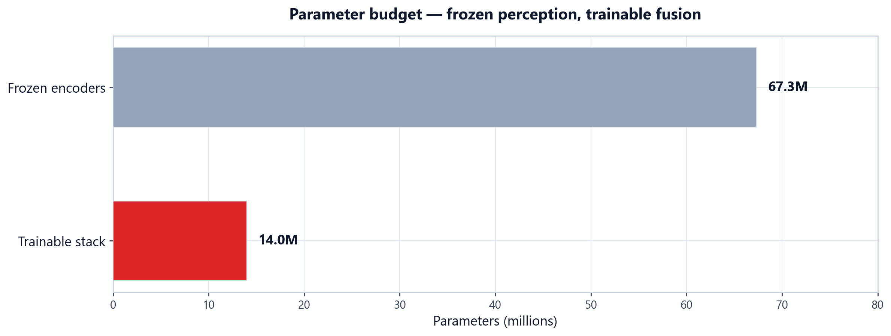
</div>

## Mathematical Formulation

**Stimulus features.** For each modality $m \in \{v, a, \ell\}$ a frozen encoder produces a per-timestep embedding:

$$z_m(t) = \mathrm{Enc}_m\big(x_m(t)\big), \qquad z_m(t) \in \mathbb{R}^{d_m}, \quad d_v = 640,\ d_a = d_\ell = 384.$$

**Projection and motion.** Each stream is projected to a shared space, with a depthwise temporal convolution added on the video stream:

$$h_m(t) = P_m\big(z_m(t)\big) \in \mathbb{R}^{512}, \qquad \tilde{h}_v(t) = h_v(t) + \big(\mathrm{DWConv1D}_{k=3}\, h_v\big)(t).$$

**Interleaved attention with HRF decay.** The interleaved token sequence $u = [\dots, v_t, a_t, \ell_t, \dots]$ is processed by self-attention whose first two layers carry a hemodynamic bias:

$$\mathrm{Attn}(Q, K, V) = \mathrm{softmax}\!\left(\frac{QK^{\top}}{\sqrt{d_k}} + B\right) V, \qquad B_{ij} = -\alpha\,|\Delta t_{ij}|,$$

where $\alpha$ is a learned per-layer decay rate and $\Delta t_{ij}$ is the temporal distance between tokens.

**Sparse expert routing.** Each feed-forward block computes a top-2 mixture of experts:

$$y(x) = \sum_{e \in \mathrm{Top2}(g(x))} \frac{\exp g_e(x)}{\sum_{e' \in \mathrm{Top2}} \exp g_{e'}(x)}\, E_e(x),$$

stabilized by the load-balancing auxiliary loss $\mathcal{L}_{\mathrm{aux}} = N \sum_{e} f_e P_e$ and a router z-loss.

**Gated modality pooling.** At every timestep the three modality tokens are fused with learned gates:

$$g(t) = \sigma\big(W_g\, h(t)\big) \in \mathbb{R}^{3}, \qquad \hat{h}(t) = \sum_{m} g_m(t)\, h_m(t).$$

**Hemodynamic convolution.** The fused sequence is convolved with a learnable kernel initialized from the canonical double-Gamma HRF:

$$h(t) = \frac{t^{a_1} e^{-t/b_1}}{b_1^{a_1}\, \Gamma(a_1)} \;-\; c\, \frac{t^{a_2} e^{-t/b_2}}{b_2^{a_2}\, \Gamma(a_2)},$$

encoding the ~6 s delay and ~12 s undershoot of the BOLD response.

**Subject-conditioned head.** The cortical output for subject $s$ is produced by FiLM conditioning of a shared head:

$$y_s = \gamma_s \odot x + \beta_s, \qquad \hat{y}_s = W_{\mathrm{out}}\, y_s \in \mathbb{R}^{400 \times T}.$$

**Objective.** The model is trained to maximize the mean per-parcel Pearson correlation between predictions $\hat{y}$ and targets $y$:

$$r = \frac{\sum_i (\hat{y}_i - \bar{\hat{y}})(y_i - \bar{y})}{\sqrt{\sum_i (\hat{y}_i - \bar{\hat{y}})^2}\ \sqrt{\sum_i (y_i - \bar{y})^2}}, \qquad \mathcal{L} = 1 - r,$$

augmented with temporal-coherence regularization.

## Results

Flora reaches high agreement between predicted and measured brain activity at a radically small trainable parameter count.

| Metric | Value |
|:---|:---|
| **Best Pearson r (validation)** | **0.7278** |
| **Best epoch** | 52 |
| **Pearson r at epoch 0** | 0.0328 |
| **Pearson r at epoch 250** | 0.6158 |

> *Pearson r is the mean per-parcel correlation between model predictions and targets on a held-out set of 40 clips.*

### Training dynamics

<div align="center">
  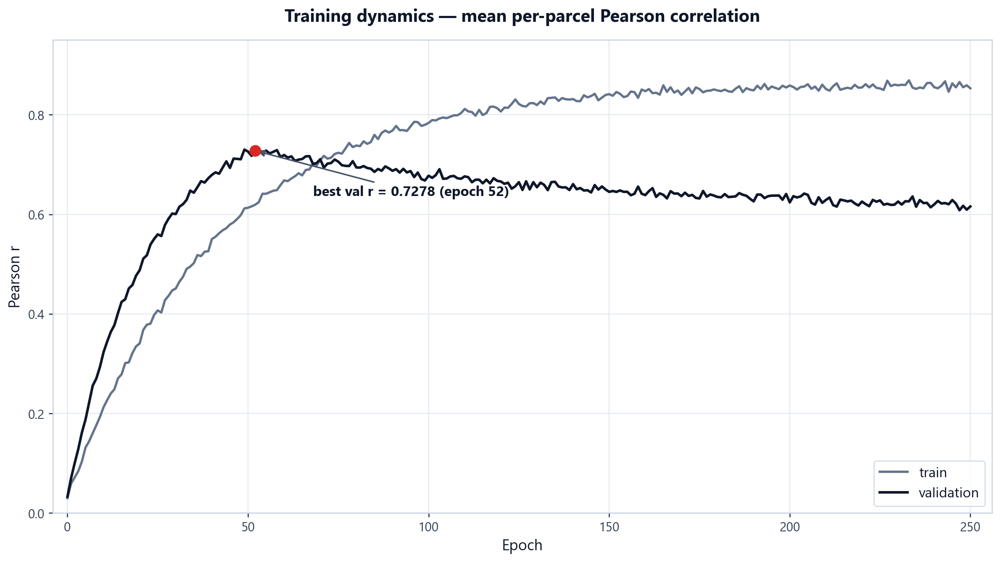
</div>

### Temporal dynamics of predictions

<div align="center">
  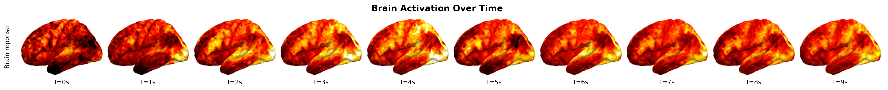
</div>

### Mean and peak activation distribution

| Mean activation | Peak activation |
|:---:|:---:|
| 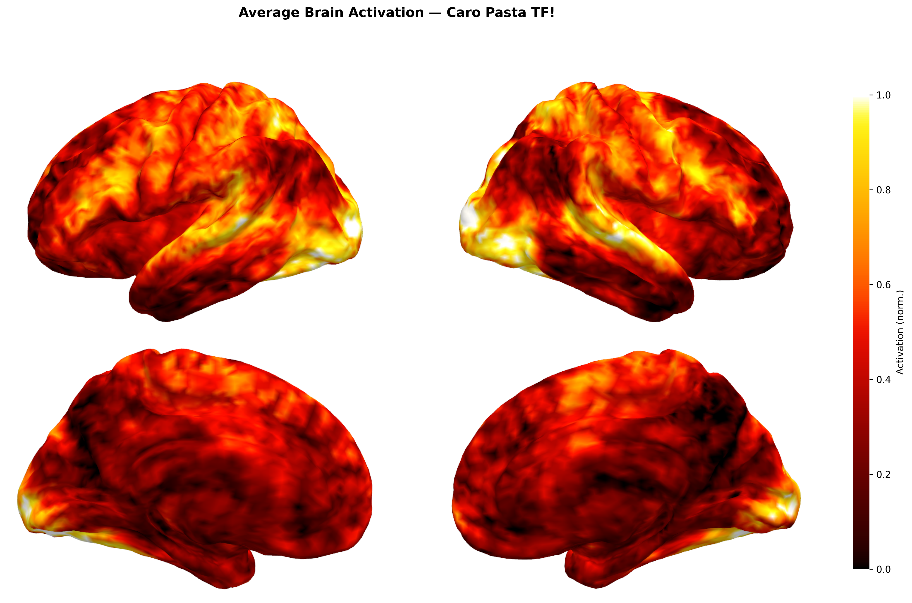 | 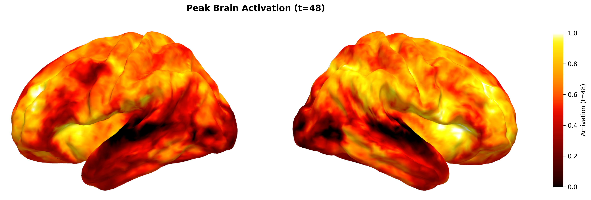 |

### Cortical surface renders

| Colormap "fire" | Colormap "seismic" |
|:---:|:---:|
| 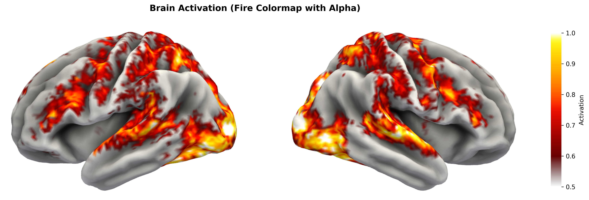 | 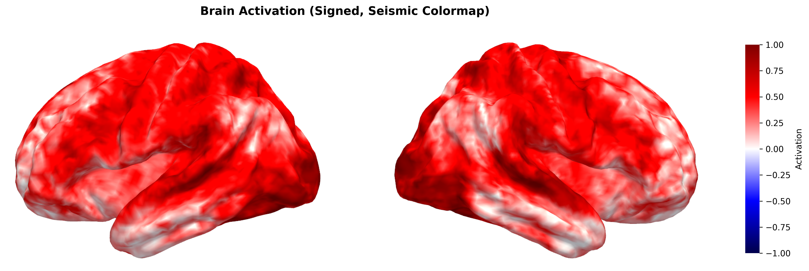 |

### Predicted cortical activity maps

Examples of surface activity maps produced by Flora on held-out video clips:

| # | Activation map |
|:---:|:---:|
| 1 | 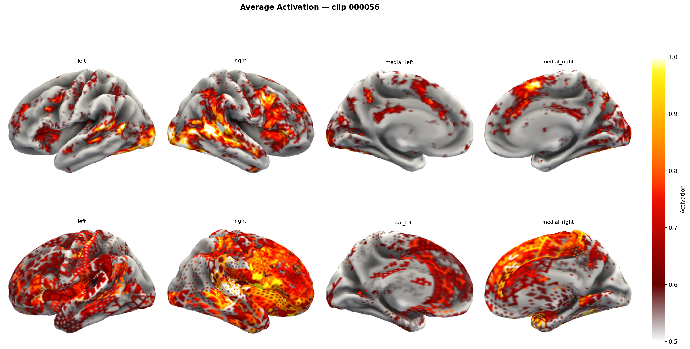 |
| 2 | 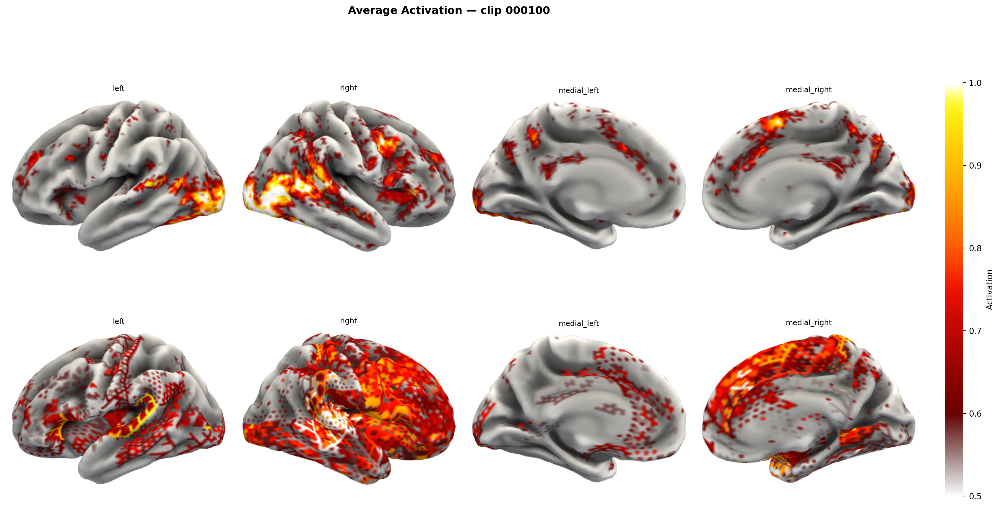 |
| 3 | 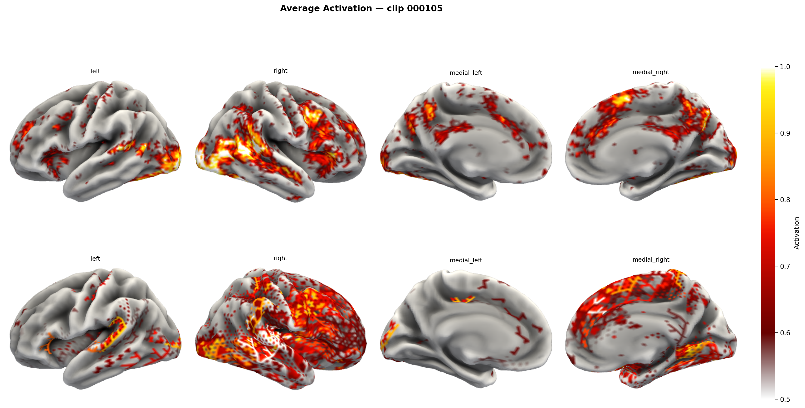 |
| 4 | 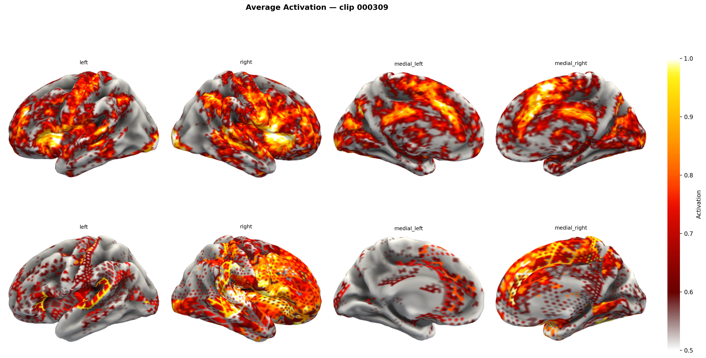 |
| 5 | 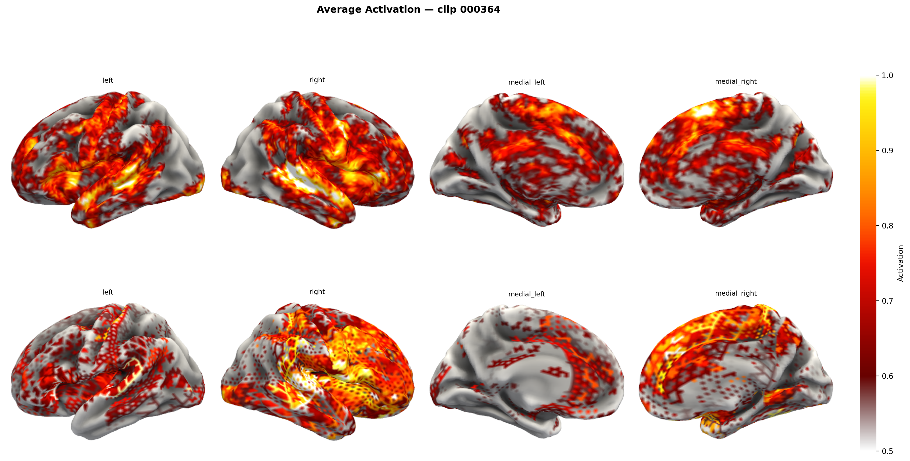 |
| 6 | 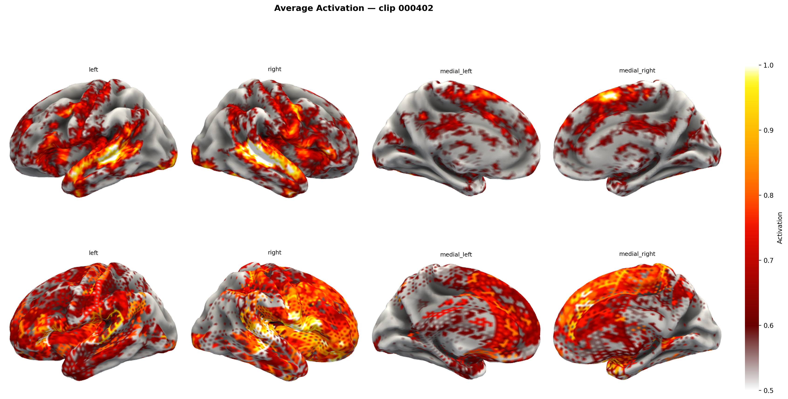 |

## Quick Start

```bash
git clone https://github.com/qaddasd/Flora.git
cd Flora
pip install -r requirements.txt
```

**Sanity check** (loads the checkpoint and runs a test forward pass):

```bash
python test_flora.py
```

**Inference on a video** (extracts audio/video/text features and builds the predicted brain activity):

```bash
python run_flora.py --video path/to/video.mp4 --out_dir output
```

**Extract precomputed features from the video corpus:**

```bash
python flora/extract_features_v3.py
```

**Regenerate the figures (architecture diagram and charts):**

```bash
python scripts/generate_architecture_diagram.py
python scripts/generate_charts.py
```

## Project Structure

```text
flora/                          # Main package
├── v3_model.py                 #   Flora model (projectors, MoE transformer, HRF, FiLM head)
├── v3_train.py                 #   Training loop and losses
├── v3_pretrain.py              #   Self-supervised pretraining stage
├── v3_pipeline.py              #   End-to-end training orchestration
├── v3_dataset.py               #   Dataset and data loaders
├── v3_sparse.py                #   Sparse routing variant
├── v3_benchmark_sparse.py      #   Sparse model benchmark
├── model.py                    #   Compact base fusion model
├── moe_model.py                #   Mixture-of-Experts blocks
├── backbones.py                #   Frozen encoder stack
├── config.py                   #   Configuration (dataclass)
├── train.py                    #   Base training entry point
├── train_lightning.py          #   PyTorch Lightning training module
├── distillation.py             #   Knowledge-distillation losses
├── extract_features_v3.py      #   Multimodal feature extraction
├── export_onnx.py              #   ONNX export and quantization
├── inference_kaggle.py         #   Standalone inference script
└── architecture_diagram.py     #   Legacy diagram generator

scripts/                        # Visualization (architecture figure, charts, surface renders)
assets/                         # Architecture figure and training charts
plots/                          # Predicted cortical activity maps
data/                           # Local dataset features (not tracked)
checkpoints/                    # Model weights (not tracked)
run_flora.py                    # CLI: video -> predicted brain activity
test_flora.py                   # CLI: checkpoint sanity check
```

## Checkpoints and Data

- Best checkpoint: `checkpoints/best-epoch=052-val/pearson_r=0.7278.ckpt` — available from the authors on request.
- Training input-output pairs are sampled from **200 videos** of the **[CINE Brain Dataset](https://github.com/onepunchmonk/cine-brain)**: **160 clips for training**, **40 clips held out for validation/test**, fMRI recorded at **TR = 1.5 s**.

## Citation

If you use Flora, please cite:

```bibtex
@software{flora2026,
  title  = {Flora: A Lightweight Multimodal Brain Encoding Model},
  author = {Kenzhegali, Nuras and Sarsenbai, Alikhan},
  year   = {2026},
  url    = {https://github.com/qaddasd/Flora}
}
```

## Authors

- **Kenzhegali Nuras**
- **Sarsenbai Alikhan**

---

# Русский

## Обзор

Flora — полнообъёмная модель кодирования мозга: по звуковой дорожке, видеоряду и транскрипту видео она предсказывает BOLD-ответ (уровень оксигенации крови) коры головного мозга человека во времени. Дизайн опирается на три принципа:

1. **Замороженное восприятие, обучаемый синтез.** Все три энкодера стимулов заморожены; обучаются только мультимодальный блок синтеза и кортикальная выходная голова. Бюджет обучаемых параметров — ~14M, обучение стабильно на одной GPU.
2. **Нейрофизические априорные ограничения.** Известная гемодинамическая задержка ~6 с встроена как индуктивное смещение через обучаемую свёртку функции гемодинамического ответа (HRF) и HRF-затухающее смещение внимания, а не выучивается из данных.
3. **Разреженные специализированные вычисления.** Трансформер со смесью экспертов (MoE) позволяет экспертам специализироваться по модальностям и кортикальным системам при постоянных вычислительных затратах, а гейтованное объединение модальностей даёт каждой кортикальной области взвешивать текст, аудио и видео согласно её функциональной роли.

## Ключевые особенности

- **Мультимодальное кодирование** — совместно потребляет видео (2 кадра/с), аудио (16 кГц) и транскрипт.
- **~14M обучаемых параметров** — на два порядка меньше классических крупномасштабных моделей кодирования.
- **HRF-осведомлённое временное моделирование** — обучаемая двойная гамма-HRF свёртка плюс HRF-затухающее смещение внимания.
- **Синтез на смеси экспертов** — 8 экспертов, маршрутизация top-2, балансировка нагрузки и z-потери регуляризации.
- **Обобщение на новых субъектов** — FiLM-кондиционирование по субъекту заменяет отдельные весовые матрицы; новый субъект требует лишь двух малых векторов кондиционирования.
- **End-to-end конвейер** — извлечение признаков, инференс и рендер кортикальной поверхности из одного видеофайла.

## Архитектура

Конвейер (см. рисунок в начале) обрабатывает три параллельных потока, извлечённых из входного видео.

### 1. Замороженные модальные энкодеры

| Модальность | Энкодер | Выходная размерность | Параметры |
|:---|:---|:---:|:---:|
| Текст (транскрипт) | `all-MiniLM-L6-v2` | 384 | 22.7M (заморожен) |
| Аудио (16 кГц) | Энкодер `Whisper-Tiny` | 384 | 39M (заморожен) |
| Видео (2 кадра/с) | `MobileViT-S` | 640 | 5.6M (заморожен) |

### 2. Модальные проекторы

Выход каждого энкодера проходит через собственный 3-слойный MLP-проектор ($d_m \rightarrow 768 \rightarrow 512$) с LayerNorm и GELU. За видео-проектором следует глубинная временная свёртка (ядро 3), добавляющая межкадровый сигнал движения, отсутствующий у покадровых энкодеров, — критично для motion-чувствительной коры (MT+/V5).

### 3. Токенизация времени

Добавляются обучаемые временные эмбеддинги по модальностям, затем три потока перемежаются в единую последовательность токенов $[v_1, a_1, \ell_1, v_2, a_2, \ell_2, \dots]$, чтобы кросс-модальное внимание на одном шаге времени было доступно с первого слоя. Поверх добавляется общий позиционный эмбеддинг.

### 4. Трансформер синтеза со смесью экспертов

Четыре pre-norm трансформерных слоя (8 голов x 64-d):

- **Слои 1-2** — локальное временное внимание с обучаемым HRF-затухающим смещением: недавняя история стимула доминирует в текущем BOLD-ответе.
- **Слои 3-4** — полное внимание для нарративной семантической интеграции.
- Каждый feed-forward блок — **смесь экспертов**: 8 экспертов, маршрутизация top-2, вспомогательные потери балансировки нагрузки и z-потери роутера для стабильной равномерной загрузки экспертов.
- Стохастическая глубина с линейным расписанием регуляризует глубокие слои.

### 5. Гейтованное объединение модальностей

Вместо усреднения трёх модальных токенов на каждом шаге Flora обучает сигмоидные гейты по тексту/аудио/видео, чтобы разные кортикальные области взвешивали модальности по своей функции (зрительная кора -> видео, речевая кора -> текст).

### 6. Свёртка HRF

Глубинная временная свёртка (ядро 8, ~12 с при TR = 1.5 с), инициализированная каноническим двойным гамма-HRF ядром и дообучаемая в процессе тренировки.

### 7. Выходная голова с условием на субъекта

Общий MLP отображает синтезированные представления к коре; FiLM-кондиционирование по субъекту ($\gamma_s \odot x + \beta_s$) поглощает анатомическую вариабельность. Голова выдаёт 400 парцеллярных временных рядов (Schaefer-400), разворачиваемых на поверхность fsaverage5 с 20 484 вершинами для оценки и рендера.

### Бюджет параметров

| Компонент | Обучаемые параметры |
|:---|:---:|
| Модальные энкодеры (заморожены) | 0 (67.3M заморожено) |
| Проекторы + модуль временного движения | ~2.5M |
| MoE-трансформер синтеза (4 слоя) | ~9M |
| Гейтинг, HRF-свёртка, эмбеддинги | ~0.4M |
| Выходная голова + FiLM субъекта | ~2M |
| **Всего обучаемых** | **~14M** |

<div align="center">
  
</div>

## Математическая формулировка

**Признаки стимула.** Для каждой модальности $m \in \{v, a, \ell\}$ замороженный энкодер строит эмбеддинг на каждом шаге времени:

$$z_m(t) = \mathrm{Enc}_m\big(x_m(t)\big), \qquad z_m(t) \in \mathbb{R}^{d_m}, \quad d_v = 640,\ d_a = d_\ell = 384.$$

**Проекция и движение.** Каждый поток проецируется в общее пространство, при этом к видео-потоку добавляется глубинная временная свёртка:

$$h_m(t) = P_m\big(z_m(t)\big) \in \mathbb{R}^{512}, \qquad \tilde{h}_v(t) = h_v(t) + \big(\mathrm{DWConv1D}_{k=3}\, h_v\big)(t).$$

**Перемежённое внимание с HRF-затуханием.** Перемежённая последовательность токенов $u = [\dots, v_t, a_t, \ell_t, \dots]$ обрабатывается самовниманием, первые два слоя которого несут гемодинамическое смещение:

$$\mathrm{Attn}(Q, K, V) = \mathrm{softmax}\!\left(\frac{QK^{\top}}{\sqrt{d_k}} + B\right) V, \qquad B_{ij} = -\alpha\,|\Delta t_{ij}|,$$

где $\alpha$ — обучаемая скорость затухания для каждого слоя, $\Delta t_{ij}$ — временное расстояние между токенами.

**Разреженная маршрутизация экспертов.** Каждый feed-forward блок вычисляет top-2 смесь экспертов:

$$y(x) = \sum_{e \in \mathrm{Top2}(g(x))} \frac{\exp g_e(x)}{\sum_{e' \in \mathrm{Top2}} \exp g_{e'}(x)}\, E_e(x),$$

стабилизированную вспомогательными потерями балансировки $\mathcal{L}_{\mathrm{aux}} = N \sum_{e} f_e P_e$ и z-потерями роутера.

**Гейтованное объединение модальностей.** На каждом шаге три модальных токена сливаются обучаемыми гейтами:

$$g(t) = \sigma\big(W_g\, h(t)\big) \in \mathbb{R}^{3}, \qquad \hat{h}(t) = \sum_{m} g_m(t)\, h_m(t).$$

**Гемодинамическая свёртка.** Синтезированная последовательность свёртывается обучаемым ядром, инициализированным каноническим двойным гамма-HRF:

$$h(t) = \frac{t^{a_1} e^{-t/b_1}}{b_1^{a_1}\, \Gamma(a_1)} \;-\; c\, \frac{t^{a_2} e^{-t/b_2}}{b_2^{a_2}\, \Gamma(a_2)},$$

кодирующим задержку ~6 с и постстимульное падение ~12 с BOLD-ответа.

**Голова с условием на субъекта.** Кортикальный выход для субъекта $s$ строится FiLM-кондиционированием общей головы:

$$y_s = \gamma_s \odot x + \beta_s, \qquad \hat{y}_s = W_{\mathrm{out}}\, y_s \in \mathbb{R}^{400 \times T}.$$

**Целевая функция.** Модель обучается максимизировать среднюю по парцеллам корреляцию Пирсона между предсказаниями $\hat{y}$ и целями $y$:

$$r = \frac{\sum_i (\hat{y}_i - \bar{\hat{y}})(y_i - \bar{y})}{\sqrt{\sum_i (\hat{y}_i - \bar{\hat{y}})^2}\ \sqrt{\sum_i (y_i - \bar{y})^2}}, \qquad \mathcal{L} = 1 - r,$$

дополненную регуляризацией временной когерентности.

## Результаты

Flora демонстрирует высокое соответствие предсказанной и измеренной активности мозга при радикально малом числе обучаемых параметров.

| Метрика | Значение |
|:---|:---|
| **Лучший Pearson r на валидации** | **0.7278** |
| **Лучшая эпоха** | 52 |
| **Pearson r на эпохе 0** | 0.0328 |
| **Pearson r на эпохе 250** | 0.6158 |

> *Pearson r вычисляется как средняя по парцеллам корреляция между предсказаниями модели и целевыми ответами на отложенном наборе из 40 клипов.*

### Динамика обучения

<div align="center">
  
</div>

### Временная динамика предсказаний

<div align="center">
  
</div>

### Среднее и пиковое распределение активности

| Средняя активация | Пиковая активация |
|:---:|:---:|
|  |  |

### Рендеры кортикальной поверхности

| Колормап "fire" | Колормап "seismic" |
|:---:|:---:|
|  |  |

### Предсказанные карты кортикальной активности

Примеры поверхностных карт активности, полученных Flora на отложенных видеоклипах:

| # | Карта активации |
|:---:|:---:|
| 1 |  |
| 2 |  |
| 3 |  |
| 4 |  |
| 5 |  |
| 6 |  |

## Быстрый старт

```bash
git clone https://github.com/qaddasd/Flora.git
cd Flora
pip install -r requirements.txt
```

**Проверка работоспособности** (загружает чекпоинт и выполняет тестовый прямой проход):

```bash
python test_flora.py
```

**Инференс на видео** (извлекает аудио/видео/текстовые признаки и строит предсказанную активность мозга):

```bash
python run_flora.py --video path/to/video.mp4 --out_dir output
```

**Извлечение предвычисленных признаков из корпуса видео:**

```bash
python flora/extract_features_v3.py
```

**Перегенерация фигур (диаграмма архитектуры и графики):**

```bash
python scripts/generate_architecture_diagram.py
python scripts/generate_charts.py
```

## Структура проекта

```text
flora/                          # Основной пакет
├── v3_model.py                 #   Модель Flora (проекторы, MoE-трансформер, HRF, FiLM-голова)
├── v3_train.py                 #   Цикл обучения и функции потерь
├── v3_pretrain.py              #   Фаза самообучаемого претрейнинга
├── v3_pipeline.py              #   Оркестрация end-to-end обучения
├── v3_dataset.py               #   Датасет и загрузчики
├── v3_sparse.py                #   Разреженный вариант маршрутизации
├── v3_benchmark_sparse.py      #   Бенчмарк разреженной модели
├── model.py                    #   Компактная базовая fusion-модель
├── moe_model.py                #   Блоки Mixture-of-Experts
├── backbones.py                #   Замороженный стек энкодеров
├── config.py                   #   Конфигурация (dataclass)
├── train.py                    #   Базовая точка входа обучения
├── train_lightning.py          #   Модуль обучения PyTorch Lightning
├── distillation.py             #   Утилиты потерь переноса знания
├── extract_features_v3.py      #   Извлечение мультимодальных признаков
├── export_onnx.py              #   Экспорт и квантование ONNX
├── inference_kaggle.py         #   Автономный скрипт инференса
└── architecture_diagram.py     #   Легаси-генератор диаграмм

scripts/                        # Визуализация (диаграмма архитектуры, графики, рендеры поверхностей)
assets/                         # Диаграмма архитектуры и графики обучения
plots/                          # Предсказанные карты кортикальной активности
data/                           # Локальные признаки датасета (не отслеживаются)
checkpoints/                    # Веса модели (не отслеживаются)
run_flora.py                    # CLI: видео -> предсказанная активность мозга
test_flora.py                   # CLI: проверка чекпоинта
```

## Чекпоинты и данные

- Лучший чекпоинт: `checkpoints/best-epoch=052-val/pearson_r=0.7278.ckpt` — доступен по запросу у авторов.
- Пары "вход-выход" для обучения получены выборкой **200 видео** из **[CINE Brain Dataset](https://github.com/onepunchmonk/cine-brain)**: **160 клипов для обучения**, **40 клипов отложены для валидации/теста**, фМРТ записана с **TR = 1.5 с**.

## Цитирование

Если вы используете Flora, пожалуйста, цитируйте:

```bibtex
@software{flora2026,
  title  = {Flora: A Lightweight Multimodal Brain Encoding Model},
  author = {Kenzhegali, Nuras and Sarsenbai, Alikhan},
  year   = {2026},
  url    = {https://github.com/qaddasd/Flora}
}
```

## Авторы / Authors

- **Кенжегали Нурас / Kenzhegali Nuras** (10 «F» класс)
- **Сарсенбай Алихан / Sarsenbai Alikhan** (9 «E» класс)
- Казахстан, г. Актау / Aktau, Kazakhstan

Репозиторий: https://github.com/qaddasd/Flora.git

## Лицензия / License

Проект распространяется под некоммерческой открытой лицензией **Flora Non-Commercial Share-Alike & Attribution License (CC BY-NC-SA 4.0 + Notification Rider)**:
1. **Attribution (Обязательное авторство):** Любое использование или цитирование обязано указывать авторов (*Кенжегали Нурас, Сарсенбай Алихан*) и ссылку на репозиторий.
2. **Non-Commercial (Некоммерческое использование):** Запрещено использование в коммерческих целях без предварительного письменного согласия авторов.
3. **Share-Alike / Open Source (Обязательный Open Source):** Любые производные работы, адаптации или форки обязаны быть полностью открытыми под теми же условиями.
4. **Mandatory Notification (Уведомление):** При использовании технологии в публикациях или релизах необходимо уведомить авторов (через Issue или контакты).

Подробности см. в файле [LICENSE](./LICENSE).
